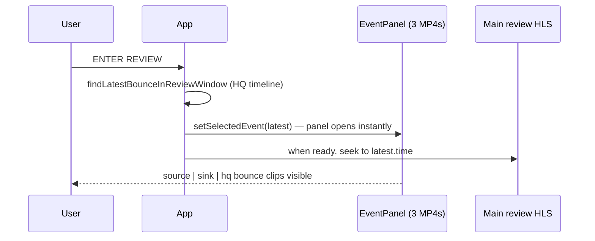

# Bounce Clips, HQ Timeline, and Review Mode Auto-Open

This document covers three behaviours that are easy to confuse: how bounce clips are tied to **HQ frames**, why **live-mode timeline dots** can disagree across cameras, and what happens when you click **ENTER REVIEW**.

---

## 1. How bounce clips are shown and imported (HQ frame is the anchor)00

Bounces come from `flight_shots.csv`. Each row with a valid `bounce_frame` becomes an event on the server (`tri_stream_Server_sim.py`).

### Server: HQ frame drives everything

1. **`bounce_frame`** (source-side frame) is the **filename key** for the MP4 clips:
   ```
   /clips/{source|sink|hq}/bounce_{bounce_frame}_{flight_id}.mp4
   ```
   The player builds the same URL in `EventPanel.jsx`. All three cameras use the **same** `bounce_frame` in the filename — the clip on disk is keyed off the source bounce frame, not HQ.

2. **`hq_frame`** is the **timeline anchor**. On ingest the server resolves it as:
   - Use `bounce_hq_frame` from the CSV when present, else
   - Map `bounce_frame` → HQ via `source_to_hq` in the sync CSV.

3. From that HQ frame, `_position_from_hq_frame()` derives **per-camera** `segments`, `offsets`, and `frames` (source, sink, hq) using the frame index tables and sync maps. That payload is what `GET /events` returns.

4. Only bounces whose HQ frame falls inside the **180 s DVR window** (`BOUNCE_EVENT_WINDOW_SEC`, ~5400 frames at 30 fps) are kept.

### Player: dots and clips use different “roots”

| What | Driven by |
|------|-----------|
| **Timeline dot position** | HQ-based `segments` / `offsets` from `/events`, converted to seconds on the visible timeline |
| **Which bounces appear** | Row must have `bounce_frame` set (clip is assumed to exist) |
| **EventPanel video files** | `bounce_{bounce_frame}_{flight_id}.mp4` per camera |

So: **when the bounce happened** is localized via **HQ frame** on the server; **which file to play** is keyed by **source `bounce_frame`**.

---

## 2. Why live mode has a mismatch across the three camera timelines

In **live mode**, bounce dots are **not** always placed on a single shared clock.

- The server always stores positions derived from **HQ frame** (correct cross-camera alignment in data).
- The player places dots using `mappedEvents` in `App.jsx`.
- In live mode, `timelineCam = activeCam` — the dot’s time is computed on the **currently selected camera’s** HLS timeline (`segmentStartTimesRef[activeCam]` + offset), not HQ.

So if you are on **Source**, dots use source media time. If you switch to **HQ**, the same bounce is re-mapped onto the HQ buffer. Because each camera’s live HLS window starts at a different media offset and segments can load at different rates, **the same bounce can appear at different horizontal positions** depending on which camera is active.

In **review mode** this is intentionally unified: `timelineCam` is always **`hq`**, and the pinned 0…T review timeline is gapless on HQ.

### Status: should be fixed, needs testing

The intended fix is to **always place bounce dots on the HQ timeline in live mode** (same canonical clock as review), while still allowing the user to watch any camera. That alignment work is **not fully validated yet** — it needs testing across camera switches, buffer lag, and `/events` refresh before we treat it as done.

---

## 3. Review mode: three bounce clips open automatically on ENTER REVIEW

When the user clicks **ENTER REVIEW**, the bottom **EventPanel** opens **immediately** with **three bounce MP4 clips** (source | sink | hq) for the **latest bounce** in the pinned 30-segment window — no extra click on a dot.

### Step-by-step

1. **Snapshot** — Last 30 segments from each camera’s rolling buffer are frozen into local blob VOD playlists (main player on top).

2. **Find latest bounce** — `findLatestBounceInReviewWindow()` scans all events and maps each to HQ review time via `mapEventToReviewTime()`. The event with the **highest `time`** inside `[minAbs, maxAbs]` of the pinned HQ segments wins.

3. **Instant panel open** — If a latest bounce exists, `setSelectedEvent(latestBounce)` runs **synchronously** inside `enterReview()`. The layout expands EventPanel to 50% height because `selectedEvent` is set. EventPanel renders three `<video>` elements:
   ```
   /clips/source/bounce_{bounce_frame}_{flight_id}.mp4
   /clips/sink/bounce_{bounce_frame}_{flight_id}.mp4
   /clips/hq/bounce_{bounce_frame}_{flight_id}.mp4
   ```

4. **Main timeline follows** (after HLS is ready) — A `useEffect` waits until review HLS manifests, `syncMap`, and `mappedEvents` are ready, then `handleSeek(latest.time)` moves the **top** main HLS playhead to that bounce dot. Close on EventPanel is hidden in review so the three clips stay visible.

5. **Fallback** — If no bounce falls in the pinned window, the panel stays closed and the playhead can go to the end of the review timeline.



### What this is not

- The **bottom three clips** are separate MP4s; they do **not** use the SeekBar on the top main HLS player.
- The **top** player is one visible camera (HQ by default) scrubbed via SeekBar; the bottom panel is the dedicated tri-camera bounce view for the selected event.

---

*Last updated: focused doc on HQ-anchored bounce clips, live timeline mismatch (fix TBD), and review auto-open behaviour.*
